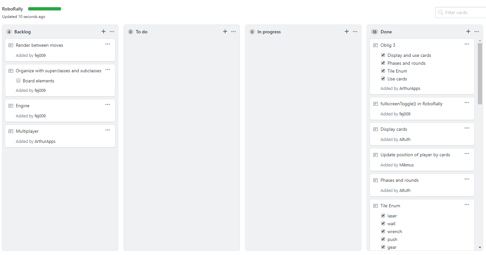

# Oblig 4

## RoboRally - a game made by Kokkene
RoboRally is a multiplayer game in which robots move around the map attempting to get to all the flags. 

### Team and Project
As a team I think we hit the mark pretty good with our roles selection and philosophy.\
We picked the roles we wanted ourselves and felt most comfortable with.\
This is probably one of the reasons we do not feel the need to change up the different roles.\
We discussed the possibility of reassigning Kristoffer, as we felt like the team lead role\
was not the most necessary for our team-methodology. Ultimately we choose to stick with the current\
roles as these have been working great for us.

#### Team roles
##### Kristoffer Kraft Johansen
Role: Team leader  
Main tasks: Ensure that the task is completed in the given time frames. Making sure communication between\
the group members is good. Updating the project board and arranging group meetings.

##### Martin Johnsen
Role: Customer Contact  
Main tasks: Take care of all enquiries regarding the project. Making sure the project is up to our set requirements.\
Updating the README.md file with useful information, and providing a UML diagram for the project.

##### Markus Jensen 
Role: Head of testing  
Main tasks: Creating useful tests that helps the developers understand, and future proof the code.\
General upkeep of the code and adding helpful comments in the code.

##### Jan Kåre Sandblåst
Role: Coding director  
Main tasks: Focus on creating useful and easy to implement code. Creating the mainframe/skeleton of our code,\
while also having the ability to help other team-members understand it. 

##### Arthur Andersen 
Role: Lead designer  
Main tasks: Learning how to use Tiled and implementing maps from tiled into the game. Creating the different\
textures we need. In general thinking about improving the experience for a real player.

#### Project Methodology
Our project methodology has been the same throughout the project, with little changes.\
We feel that we chose correct early on and did quick revisions of our methodology when needed.\
To summarize how our methodology have evolved; Firstly we started out with Scrum and XP,\
doing 1 week sprint intervals of what we had on our project board. From that we noticed a\
need of a quick revision cycle, such that we could easily identify new needs the customer had, or problems.\
Secondly we made the sprints into 3/4 days cycles. Such that we had a much more even feedback loop.\
This corresponded well with the meetings we set up, and we personally feel that we got a good development structure.

#### Retrospection
When we first started with this project, everyone in the group was taken back at first.\
This was the first time any of us had worked on a project of this scale before and it was kinda scary.\
We agreed on roles quite early, since some of us were more comfortable writing code and others drawing.\
This gave each and everyone of us the opportunity to "specialize" in the given roles and helped us tremendously.\
Working on this project, however, was not all sunshine and rainbows. There was a lot to learn when working as a team,\
especially when most of us did not have experience with it before.\
This did mean a lot of undocumented code, a project board which was nearly never updated, bad commit messages,\
and so on. Another big issue was splitting functionality. This was not something we were too concerned with at first.\
We did refactor most of the code at one point, as a lot of it was unnecessarily grouped together.\
Over time, as the code grew larger, it became harder and harder to split functionality.   

#### Improvement in retrospection
We realized as we were starting to program in the AI/computer that we should have had more focus on this from the start.\
The game works perfectly when playing in singleplayer mode, but we struggled when trying to implement multiplayer.\
We also feel like we didn't properly use the tools GitHub offered, such as the project board and different branches\
one could commit to. The way we decided to go was to just commit everything to the master branch, and not a development\
branch that someone reviewed before merging. Maybe we also could have split the program into more threads, this way it\
would have been easier to handle everything that happens on the board.

#### Communication
The communication was good from the start, as we had our biweekly meetings every Tuesday and Thursday.\
Over time, the communication got even better as we continued working on the project.\
This was especially evident when we started actively using the project board more often.\
The team worked well together, even through the quarantine, as we never did much pair programming from the start.\
Therefore, switching over to digital meetings never was difficult for us.\
It also seemed like everyone where motivated to work with the project,\
so meetings did not really feel less efficient than before the quarantine either.

### Requirements

#### User Stories

1.  As a player, I want someone to play with.
2.  As a developer, I want good commit messages, such that i can easily see what was edited.
3.  As a player, I want the implemented features to be bug-free. 

#### Acceptance Criterias

1.  Have a simple computer that plays some cards.
2.  The message contains all noteworthy changes, and documents them properly.
3.  All implemented features the player can interact with, should work accordingly, and without game-breaking bugs.

##### Implementation

1.  Create a non-player object that does some legal moves.
    1.  We chose to create an AI to play with.
    2.  4 difficulties added ranging from easy to insane. Which has 4 different implementations of algorithms.
    3.  You can play with up to 7 AI's.

2.  Make the team agree on/ or create a suitable template for git commits.
    1.  Well formatted and commented commits.
    2.  Not to big ones, and not to small ones.
    3.  Always merge when pushing, to not overwrite someone elses work in the same class.

3.  Features which have been remodeled/fixed
    1.  Models for AI's have been given their appropriate color.
    2.  AI's are implemented and makes for good opponents.
    3.  All movement on the board should now have its appropriate effect

##### Project Board

      
##### Meeting minutes
[Meeting 1](https://github.com/inf112-v20/Kokkene/blob/master/Deliverables/MinutesOblig4/Tuesday310320.md)  
[Meeting 2](https://github.com/inf112-v20/Kokkene/blob/master/Deliverables/MinutesOblig4/Tuesday140420.md)  
[Meeting 3](https://github.com/inf112-v20/Kokkene/blob/master/Deliverables/MinutesOblig4/Thursday160420.md)  
[Meeting 4](https://github.com/inf112-v20/Kokkene/blob/master/Deliverables/MinutesOblig4/Tuesday210420.md)  
[Meeting 5](https://github.com/inf112-v20/Kokkene/blob/master/Deliverables/MinutesOblig4/Thursday230420.md)  
[Meeting 6](https://github.com/inf112-v20/Kokkene/blob/master/Deliverables/MinutesOblig4/Tuesday280420.md)  
[Meeting 7](https://github.com/inf112-v20/Kokkene/blob/master/Deliverables/MinutesOblig4/Thursday300420.md)  
[Meeting 8](https://github.com/inf112-v20/Kokkene/blob/master/Deliverables/MinutesOblig4/Tuesday050520.md)  
[Meeting 9](https://github.com/inf112-v20/Kokkene/blob/master/Deliverables/MinutesOblig4/Thursday070520.md)  
